# Solving Linear Inverse Problems Using the Prior Implicit in a Denoiser 
arXiv paper: https://arxiv.org/abs/2007.13640 \
Zahra Kadkhodaie, Eero P. Simoncelli 

## Contents of this repository:
### 1. Pre-trained denoisers
The [denoisers](denoisers) directory contains several universal CNN denoisers, pre-trained for removing Gaussian noise from natural images with the objective of minimizing mean square error. All denoisers are "blind": they can remove noise of any standard deviation, and this standard deviation does not need to be specified. The implicit embedded prior depends on the architecture of the denoiser as well as the images in the training set. The [denoisers](denoisers)  directory contains a separate folder for each architecture, with code specified in [code/network.py](code/network.py). Within each architecure directory, there are multiple folders containing variants of that denoiser trained on different datasets and noise ranges.

### 2. Code
The <var>code</var> directory contains the python code for the [algorithm](code/algorithm_inv_prob.py), the pre-trained [denoisers](code/network.py), and [helper functions](code/Utils_inverse_prob.py). 

### 3. Test_images
The <var>test_images</var> directory contains several commonly used [color](test_images/color) and [grayscale](test_images/grayscale) image datasets.

### 4. Demo
The notebook [Demo.ipynb](Demo.ipynb) contains code for loading a pre-trained universal denoiser, and using it to <b>draw samples</b> from the image prior that is implicitly embedded within the denoiser (see paper). It also contains code for solving a set of <b>linear inverse problems</b>: inpainting, deblurring, super-resolution, randomly-dropped pixels, and compressive sensing. Notice that there is no additional training involved for solving these problems, and the same algorithm is used for all. The algorithm uses the prior embedded in the denoiser to generate the missing parts of the partially measured image. 

[Demo.ipynb](Demo.ipynb) can be executed on CPU or GPU computing platforms. 

### Requirements 
You'll need python version 3.7.6 and the following libraries and tools to execute the code: 

numpy 1.19.4 \
skimage 0.17.2 \
matplotlib 1.19.4 \
PyTorch 1.7.0 \
argparse 1.1 \
os \
time\ 
sys \
gzip 

## Summary 
### Image priors, manifolds, and noisy observations
Visual images lie on a low-dimensional manifold, spanned by various natural deformations. Images on this manifold are approximately equally probable - at least locally. The probability of  being a natural image, ), is zero everywhere except for  lying on the manifold. 

An observed image, , contaminated with Gaussian noise,  is drawn from an observation density, ), which is a Gaussian-blurred version of the image prior. Moreover, the family of observation densities over different noise variances, ), forms a Gaussian scale-space representation of the prior, analogous to the temporal evolution of a diffusion process.

### Least squares denoising
Given a noisy observation, , the least squares estimate of the true signal is the conditional mean of the posterior:

=min_{\hat{x}}\int||\hat{x}-x||^2p(x|y)dx=\int(xp(x|y)dx)) 

### Exposing the implicit prior through Empirical Bayes estimation
For Gaussian noise contamination, Miyasawa (1961) showed that the least squares estimate can be written (exactly) as:

=\int(xp(x|y)dx)=y+\sigma^2\nabla_y\log(p(y)))

Unlike the standard formulation (an integral over the posterior density), this expresses the denoising operation in terms of the <b>gradient of the prior predictive density</b>, ). 
For intuition, we show a two-dimensional simulation/visualization for a one-dimensional manifold (green curve), and three different noise amplititudes. End of red line segments shows the least-squares optimal denoising solution  for each noisy signal, :

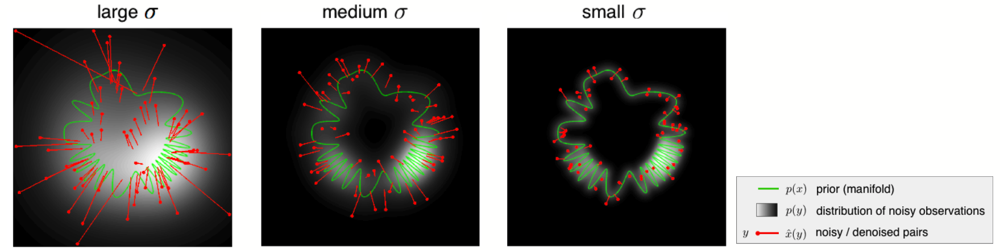

### Drawing samples from the implicit prior
Algorithm in a nutshell (see paper for details):
* Use the denoiser-defined gradient to go uphill in probability 
* On each step, the effective noise decreases, and the effective prior becomes less blurred. The denoiser, and thus the gradient step size, automatically adapts to this.
* This coarse-to-fine optimization procedure converges to a point on the manifold 

Below is a two-dimensional visualization of example trajectories of the sampling algorithm:

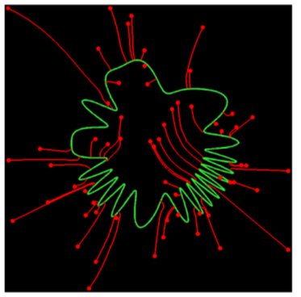

Click [here](https://www.youtube.com/watch?v=wfOq7kAc3Z8) to watch a video of the two-dimensional simulation.

When the method is used to sample an image, we can visualize points along these trajectories as sequences of images, .  Below are three pairs of sequences, for the BF-CNN denoiser trained on (1) grayscale natural images (2) color natural images and (3) the MNIST dataset of handwritten digits.  Each pair includes two sequences with different initial (leftmost) images, , and added noise, . Each sequence converges to a sample from the prior (manifold) implicit in the corresponding denoiser (rightmost images).

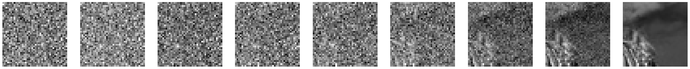
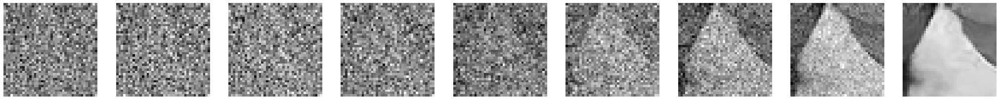

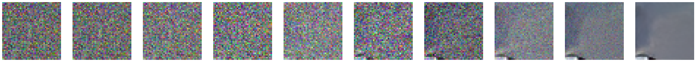
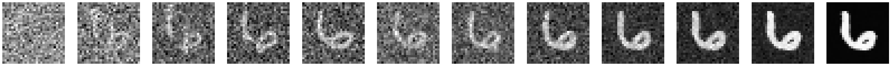
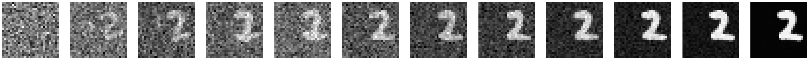

### Solving linear inverse problems using the implicit prior
Given a set of linear measurements of an image,  = , where M is a low-rank measurement matrix, we use an enhanced version of the algorithm to draw a sample of an image that satisfies these measurements (i.e., an image that lies at the intersection of the manifold and the hyperplane spanned by the column space of M). In the examples below, we show the simple (pseudo-inverse) image reconstructed from the measureents, as well as that obtained from our algorithm, for five different types of measurement matrices, M. 

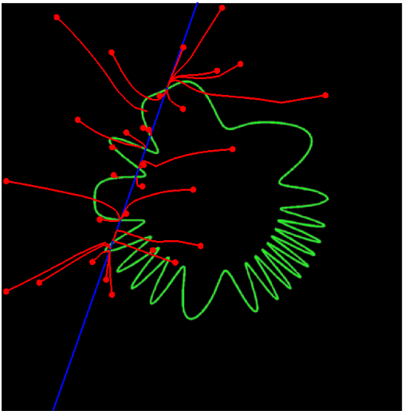

#### 1. Inpainting
Here, the algorithm must fill in a missing block of pixels (i.e., the measurement consists of the pixels outside of the missing block).  With different initializations and different additive noise, the algorithm arrives at different solutions (different points on the manifold). For each trained denoiser, we show three different samples, each of which looks natural. 

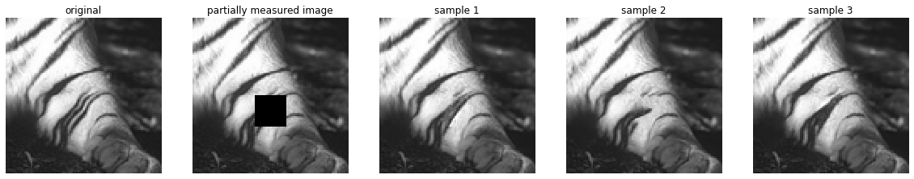
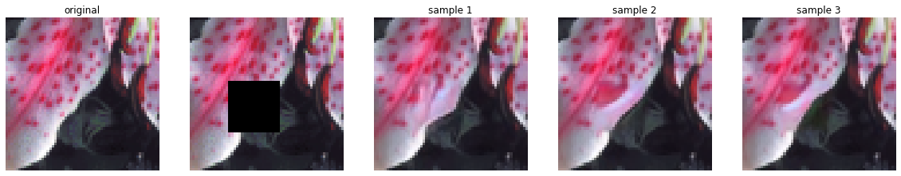
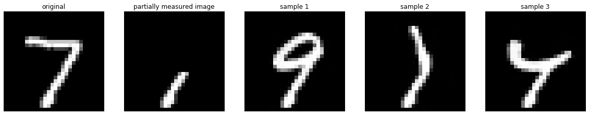

#### 2. Missing random pixels
The measurements consist of a randomly selected subset of 10% of the pixels.

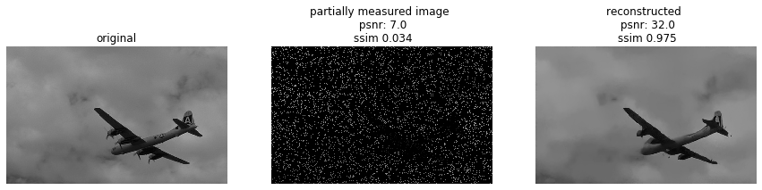
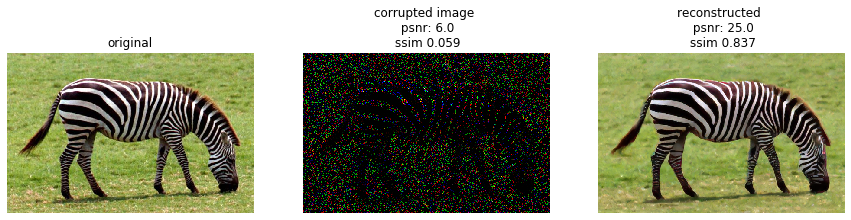
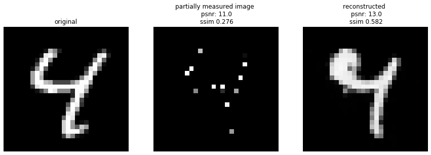

#### 3. Super-resolution
Measurements are averages of each (non-overlapping) block of 4x4 pixels.

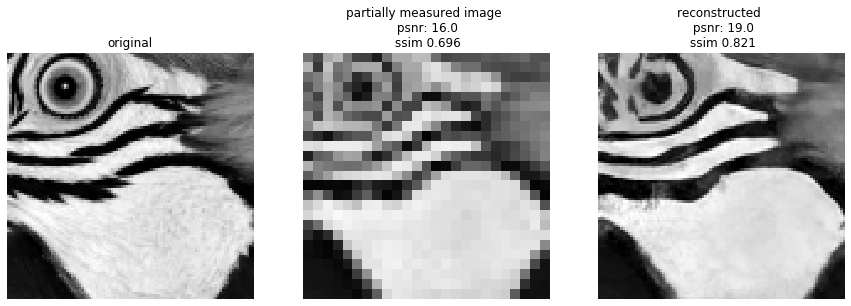
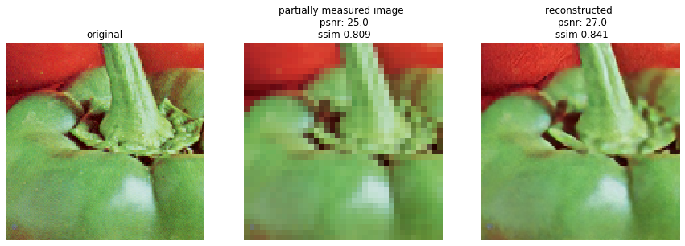
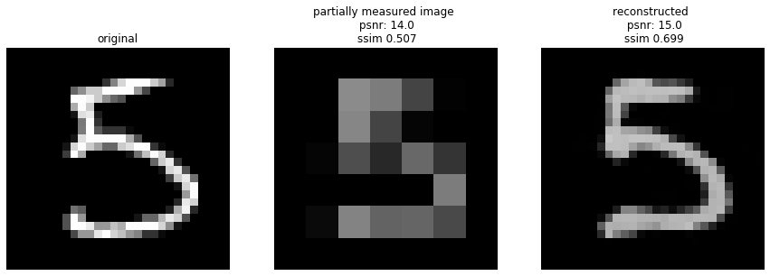

#### 4. Spectral super resolution 
Measurements consist of 10% of Fourier coefficients (the lowest frequencies).

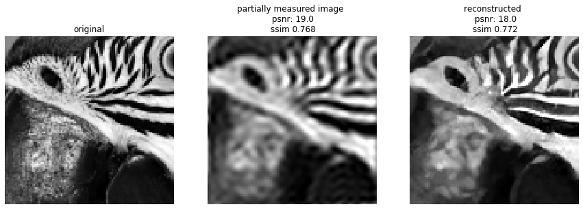
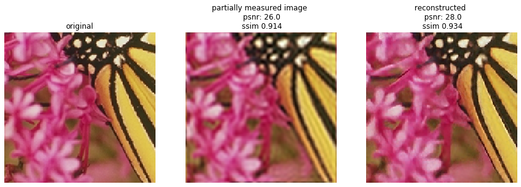
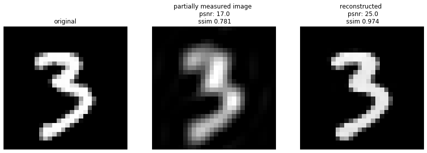

#### 5. Random basis (compressive sensing)
Here, the measurement matrix  contains random orthogonal unit vectors that span a subspace whose dimensionality is 10% of the dimensionality of the image. Thus, the measurements are the projections of the image onto a low-dimensional random subspace. 

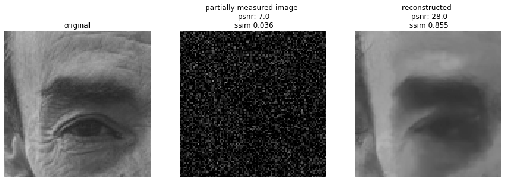
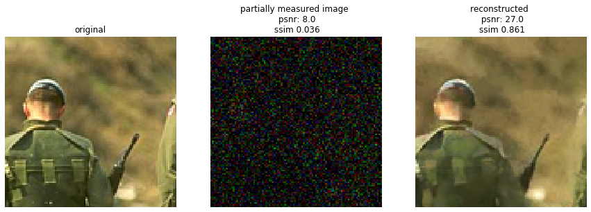
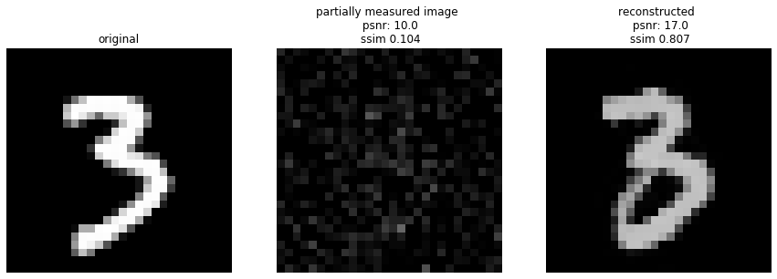

