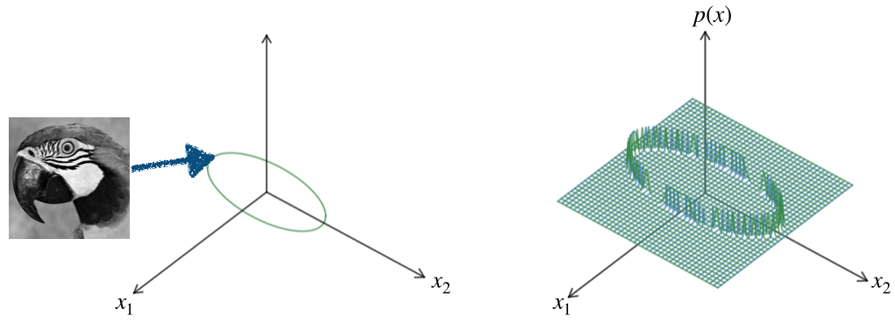
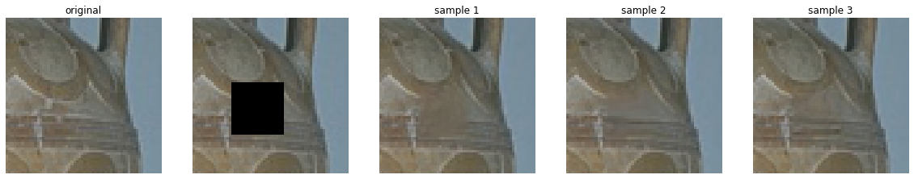
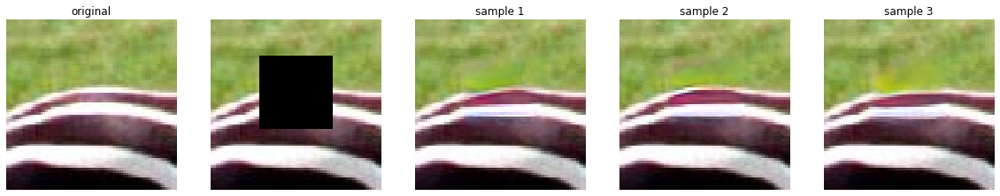
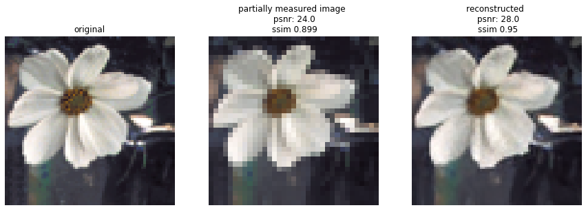

# Solving Linear Inverse Problems Using the Prior Implicit in a Denoiser 
Paper: https://arxiv.org/abs/2007.13640 \
Zahra Kadkhodaie, Eero P. Simoncelli, 

### Image priors, manifolds, and noisy observations
Visual images lie on a low-dimensional manifold, spanned by various natural deformations. Images on this manifold are approximately equally probable - at least locally. Probability of  being a natural image, , is zero everywhere except for  drawn from the manifold. 

An observed image, , contaminated with Gaussian noise,  is drawn from an observation density, , which is a Gaussian-blurred version of the image prior. Moreover, the family of observation densities over different noise variances, , forms a Gaussian scale-space representation of the prior analogous to the temporal evolution of a diffusion process

### Least squares denoising
For a noisy observation, , the least squares estimate of the true signal is the conditional mean of the posterior:\
=min_{\hat{x}}\int||\hat{x}-x||^2p(x|y)dx) 
dx) 

### Exposing the implicit prior through Empirical Bayes estimation
For Gaussian noise contamination, the least squares estimate can be written (exactly) as:\
=\intxp(x|y)dx)\ 
=y+\sigma^2\nabla_y\log p(y)) 

This is Miyasawa’s Empirical Bayes formulation (1961), which expresses the denoising operation in terms of the gradient of the prior predictive density, ). 
Below, we show a two-dimensional simulation/visualization.End of red line segments shows the least-squares optimal denoising solution  for each noisy signal, .

### Drawing high-probability samples from the implicit prior

Algorithm in a nutshell:
• Use denoiser-defined gradient to go uphill in probability \ 
• Do this iteratively \
• On each step, effect noise decreases, and effective prior becomes less blurred. Gradient step size automatically adapts to each noise level. \
• This coarse to fine optimization procedure converges to a point on the manifold! \

Two-dimensional visualization: trajectory of our iterative coarse-to-fine inverse algorithm

Click [here]() to watch a video of an animation of the two-dimensional simulatoin.

Two sequences of images, yt, from the iterative sampling procedure, with different initializations, y0, and added noise, β:

### Solving linear inverse problems using the implicit prior

Given a set of linear measurements of an image, xc = M T x, where M is a low-rank measurement matrix, we use an enhanced version of our algorithm to recover the original image

#### Inpainting

#### Missing random pixels
10% of pixels retained 

#### Super resolution
2x super resolution 

4x super resolution 

#### Spectral super resolution 
10% of fourier coefficients retained (low frequencies)

#### random basis - compressive sensing
Dimensionality reduced to 10%.

# In this repository
### Pre-trained denoisers
The directory [denoisers](denoisers) contains denoisers trained for removing Gaussian noise from natural images with the objective of minimizing mean square error. The prior embedded in a denoiser depends on the architecture of the model as well as the data used during training. The [denoisers](denoisers)  directory contains a separate folder for each denoiser with a specific architecture. The code for each architecture can be found in [code/network.py](code/network.py). Under each architecure directory, there are multiple folders for the denoiser trained on a particular dataset, and a specific noise range. 

### Code
The code directory contains code for the [algorithm](code/algorithm_inv_prob.py), the pre-trained [denoisers architecture](code/network.py), and [helper functions](code/Utils_inverse_prob.py). 

### test_images
Multiple commonly used [color](test_images/color) and [grayscale](test_images/grayscale) image datasets are uploaded in the test_images directory.

### Demo:
The [Demo.ipynb](Demo.ipynb) contains code for loading a per-trained denoiser and using it to generate samples from the prior of natural images implicit in the denoiser. It also contains code for solving various linear inverse problems (e.g. inpainting, deblurring, super-resolution, randomly-dropped pixels, compressive sensing). Notice that there is no training involved for solving these problems, as long as there is a universal blind denoiser at hand. The algorithm simply uses the prior embedded in the denoiser to generate the missing parts of the partially measured image. 

[Demo.ipynb](Demo.ipynb) can be executed on CPU or GPU. 

### Requirements 
Here is the list of libraries you need to install to execute the code: 

python  3.7.6 

numpy 1.19.4 \
skimage 0.17.2 \
matplotlib 1.19.4 \
PyTorch 1.7.0 \
argparse 1.1 \
os \
time\ 
sys \
gzip 
